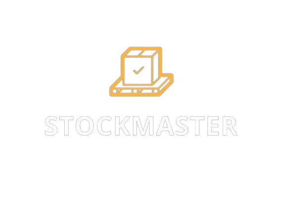

<p align="center">
  
</p>

O StockMaster é um aplicativo de gerenciamento de estoque desenvolvido em Flutter, que oferece funcionalidades como login, registro de usuários, visualização, cadastro, edição e remoção de produtos. Os dados são armazenados na nuvem usando o Firebase Authentication para autenticação e o Cloud Firestore para o banco de dados.

**Recursos:**
- **Autenticação:** Login e registro de usuários por e-mail via FirebaseAuth.
- **Produtos:** Visualização, cadastro, edição e remoção de produtos.
- **Armazenamento:** Utiliza o Cloud Firestore para armazenar dados na nuvem.
- **Design:** Interface amigável e intuitiva, projetada no Figma.


**Recursos Futuros:**

- **Categorias:** 
  - Os usuarios poderão associar produtos a categorias específicas para facilitar a organização e pesquisa.

- **Histórico de Alterações:** 
  - Vai registrar a entrada e saida de produtos.

- **Perfil do Usuário:** 
  - Os usuários vão gerenciar suas informações e configurações personalizadas.

- **Barra Inferior de Navegação:** 
  - Possibilitará uma navegação mais intuitiva entre as telas do aplicativo.

- **Incremento e Decremento Aprimorados:** 
  - Tornará a interação com a quantidade de produtos mais fácil e precisa, aprimorando a usabilidade do aplicativo.

- **Recuperação de Senha**

- **Login e Registro com Redes Sociais**

- **Ordenação de Produtos**

**Como Rodar o App**

1. **Instale as Ferramentas:**
   Certifique-se de ter o Flutter, o VS Code, o Android Studio e o Git instalados em sua máquina.

2. **Clonar o Repositório:**
   ```
   git clone https://github.com/lizandraquaresma/StockMaster.git
   ```

3. **Configurar Dependências:**
   ```
   cd StockMaster
   flutter pub get
   ```

4. **Executar o App:**
   Certifique-se de ter um emulador Android ou um dispositivo físico conectado.
   ```
   flutter run
   ```

5. **Nota:**
   - É necessário configurar um projeto no [Firebase Console](https://console.firebase.google.com/) e adicionar o arquivo `google-services.json` (para Android) e `GoogleService-Info.plist` (para iOS) ao projeto Flutter para utilizar os serviços do Firebase.

6. **Apk**
   - Caso tenha interesse em baixar o apk diretamente no seu dispositivo mobile, utilize o botão:
   - [](https://drive.google.com/uc?export=download&id=1SXvI-HYryFgROk3YnDPcsBHnuFamhgFQ)

**Autora:**
Lizandra Quaresma

**Contato:**
- Email: lizandraquaresma.dev@gmail.com
- LinkedIn: [Lizandra Quaresma](https://www.linkedin.com/in/lizandraquaresma/)

**Licença:**
Este projeto está licenciado sob a licença MIT - veja o arquivo [LICENSE](LICENSE) para detalhes.

